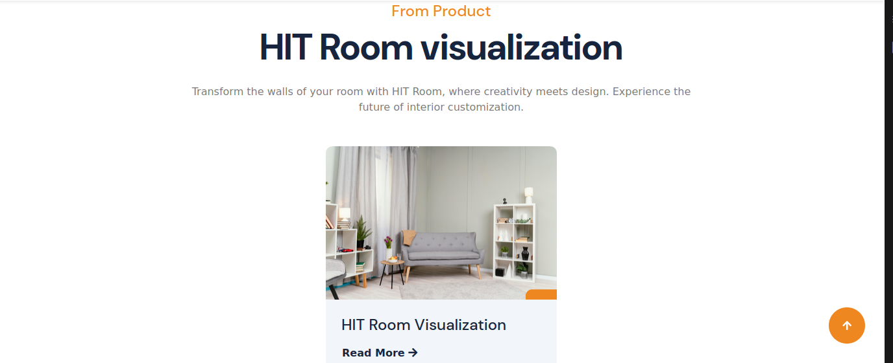
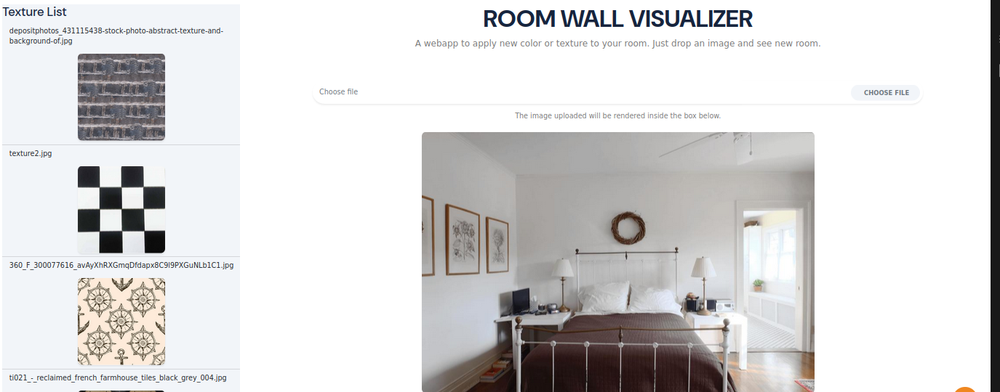
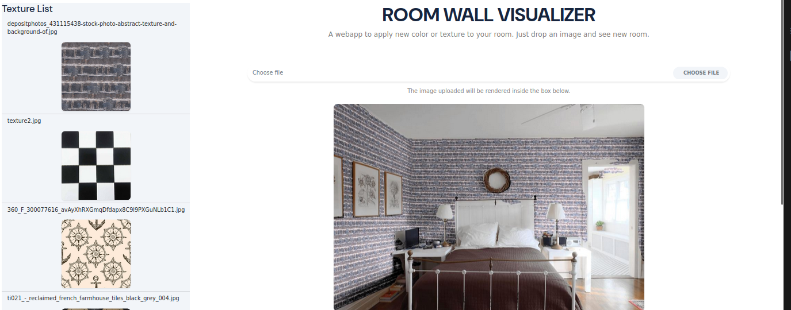

# HIT ROOM [](https://room.dhcn.vn/)




<p align="">
  
  
</p>

## 🔎 Danh Mục

1. [Giới thiệu](#Giới-thiệu)
2. [Chức năng](#Chức-năng-chính)
3. [Tổng quan hệ thống](#👩‍💻-Tổng-quan-hệ-thống)
4. [Hướng dẫn cài đặt](#Hướng-dẫn-cài-đặt)

## Giới thiệu
- Room wall visualizer: Là một công cụ trực tuyến giúp người dùng dễ dàng tùy chỉnh và trực quan hóa giao diện của các bức tường trong một căn phòng.
## Chức năng chính
Project tập trung vào các chức năng chính như sau:

- ⬆️ Tải lên hình ảnh căn phòng.

- 🟫 Tùy chỉnh giao diện của tường: Room Wall Visualizer cho phép người dùng thay đổi diện mạo của các bức tường trong căn phòng.

## 👩‍💻 Tổng quan hệ thống

Backend của hệ thống được thiết kế với các công nghệ sử dụng như sau:

-   [FastAPI](https://fastapi.tiangolo.com/): Dựng API cho backend Service.
-   [Nginx](https://nginx.org/en/): Web server cho Nginx.
-   [Docker](https://www.docker.com/): Containerize các service.
-   [Docker Compose](https://docs.docker.com/compose/): Quản lý các container.

## Hướng dẫn cài đặt

Tất cả các images build từ services backend bạn có thể tìm thấy tại [Docker Hub](https://hub.docker.com/repository/docker/hungmanhhoang/room-visualizer-app/general).


### Yêu Cầu 📋

Để cài đặt và chạy được dự án, trước tiên bạn cần phải cài đặt các công cụ bên dưới. Hãy thực hiện theo các hướng dẫn cài đặt sau, lưu ý chọn hệ điều hành phù hợp với máy tính của bạn:

-   [Docker-Installation](https://docs.docker.com/get-docker/)
-   [Docker-Compose-Installation](https://docs.docker.com/compose/install/)

### 🔨 Cài Đặt

Trước hết, hãy clone dự án về máy tính của bạn:

```bash
git clone https://github.com/HITAINTELIGENCE/Room_wall_visulizer
```

cd vào thư mục Room_wall_visulizer:

```bash
cd Room_wall_visulizer
```
### Chuẩn bị các file weight cho các model đã được huấn luyện
-  Tải các file weight cho các model đã được huấn luyện tại [đây](https://drive.google.com/drive/folders/1TllWYrTGa8rxpj1tAT0oUnykuJSXNr63?usp=drive_link) 
- Giải nén các file weight và đặt vào thư mục `room_wall_visualizer/app/Room_Wall_Visualizer/wall_segmentation/weights/` và `room_wall_visualizer/app/Room_Wall_Visualizer/wall_estimation/weight/`
- Để hiểu rõ hơn về cách các mô hình này được huấn luyện và cấu trúc của chúng, bạn có thể tham khảo mã nguồn và  notebook đã được train trên Kaggle. [link](https://www.kaggle.com/code/chiendao123/training-wall-segment)


### Chạy hệ thống
-   Start các services với 1 lệnh docker-compose:

```bash
docker-compose -f docker-compose-production.yaml up -d
```

#### PORT BINDING

-   Sau khi chạy xong, các service sẽ được chạy trên các port như sau:
<table width="100%">
    <thead>
        <th>Service</th>
        <th>PORT</th>
    </thead>

<tbody>
<tr>
<td>API Gateway</td>
<td>

8000:8000

8001:8001

8002:8002

8003:8003

8004:8004

</td>

</tr>
<tr>
<td>Auth Service</td>
<td>5000:5000</td>
</tr>
<tr>
<td>Law Service</td>
<td>8080:8080</td>
</tr>
<tr>
<td>RAG Service</td>
<td>5001:5001</td>
</tr>
<tr>
<td>Recommendation Service</td>
<td>5002:5002</td>
</tr>
</tbody>
</table>